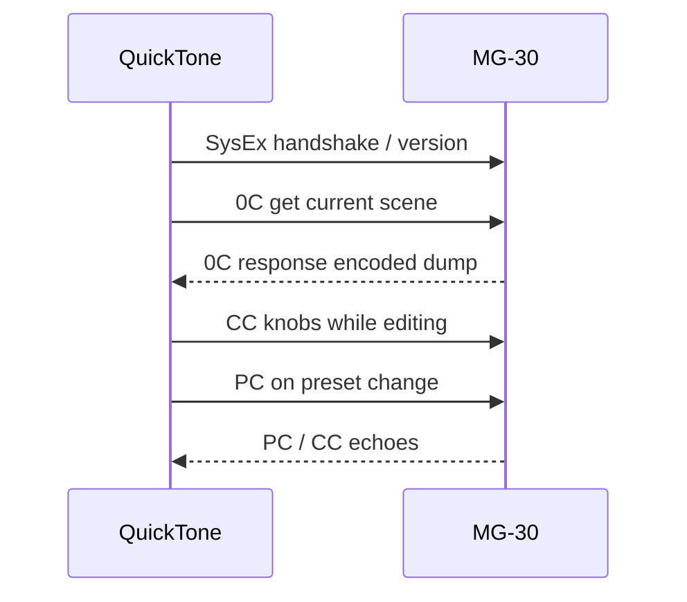

# QuickTone ↔ NUX MG-30

How the official **QuickTone** editor talks to the MG-30, and how this bridge mirrors that behavior.

## Transport

All control is USB **MIDI**:

- **Channel Voice:** Program Change (preset), Control Change (knobs, scene, expression, …)
- **SysEx:** dumps, IR, tempo, settings — header `F0 43 58 70 … F7` (Yamaha manufacturer ID `43`, NUX instrument `58`, app `70`)

See [protocol.md](protocol.md) for SysEx commands and encoding, and [ControlChanges.md](ControlChanges.md) for the CC table shown in QuickTone → Settings → Custom MIDI.

## Typical session

1. **Connect** — QuickTone opens the MG-30 MIDI ports and may send version/heartbeat SysEx.
2. **Sync patch** — Request scene current data (`0C`) or saved scene (`0B`); decode models + knobs.
3. **Edit knobs** — From an external MIDI controller (and this CLI), knobs are **CC** per ControlChanges.md. QuickTone’s own UI may also use SysEx internally; the documented external map is CC.
4. **Change preset** — Program Change `C0 <index>`; both sides may emit PC.
5. **Change scene** — CC 80 (`0x50`), values 0/1/2 for scenes 1/2/3.

## Encoding

Large SysEx payloads pack two 8-bit bytes into three 7-bit bytes. Algorithm and examples: [protocol.md](protocol.md) § “8-bits Data Encapsulation”.

## This bridge (`nux` / quicktone-bridge)

| Feature | Mechanism |
| ------- | --------- |
| `nux block set` | MIDI CC ([Parameters.md](Parameters.md)) |
| `nux block get` | SysEx `0C` dump + unpack + knob layout |
| `nux block model` | SysEx model select |
| `nux scene select` | CC 80 |
| `nux preset load` | Program Change |
| `nux sync` | Scene dump request / decode |

## Related docs

- [protocol.md](protocol.md) — SysEx command reference
- [ControlChanges.md](ControlChanges.md) — CC IDs and ranges
- [Parameters.md](Parameters.md) — param get/set contract
